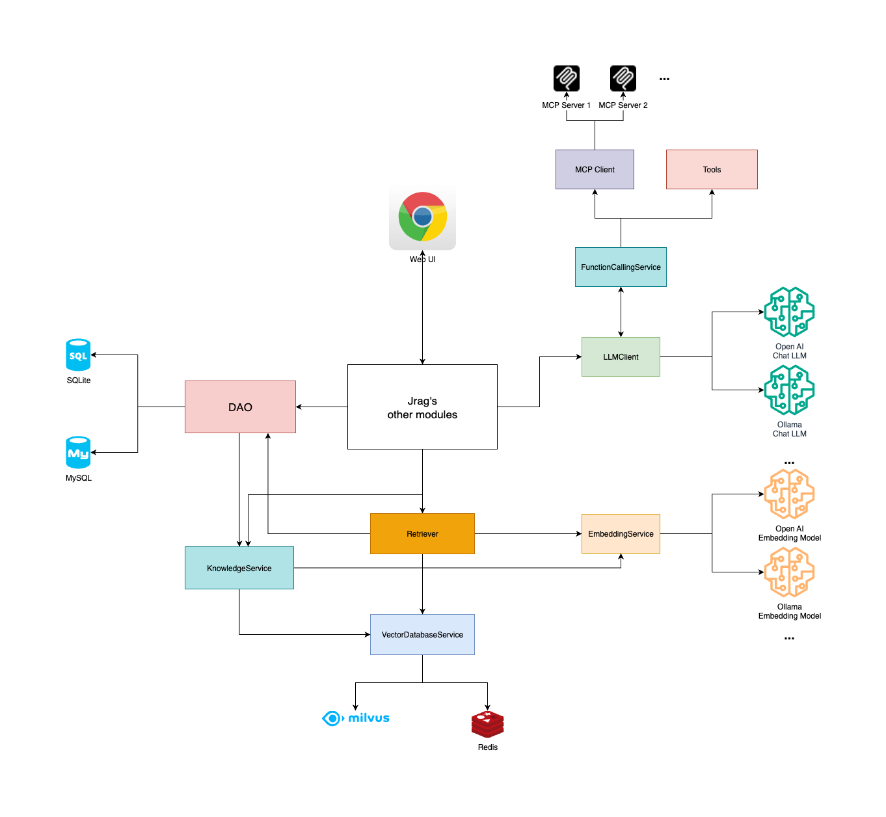

[简体中文](README.md) | English

[](https://github.com/jerryt92/jrag)

Jrag is a Retrieval-Augmented Generation (RAG) and MCP tool integration platform based on Java Spring Boot. It aims to enhance the application capabilities of large language models in the Java ecosystem by combining retrieval, MCP tools, and generative AI model technologies. The platform supports access to various mainstream large language model interfaces, including Ollama and OpenAI, and integrates with Milvus vector database to provide efficient vector storage and retrieval services.

## Contributors

<a href="https://github.com/jerryt92/jrag/graphs/contributors">
  
</a>

## One-Click Deployment with Docker

All Docker configurations are located in the `docker/` directory. By default, it will start Milvus (v2.6.9) and Jrag.

1. Pull all dependency images (optional)

```shell
docker pull maven:3.8.8-amazoncorretto-21-debian
docker pull eclipse-temurin:21-jre
docker pull alpine/git
docker pull milvusdb/milvus:v2.6.9
docker pull alpine:3.20
```

2. Pull frontend

shell
```shell
rm -rf jrag-starter/src/main/resources/dist
git clone -b dist https://github.com/jerryt92/jrag-ui.git jrag-starter/src/main/resources/dist
```

Windows
```shell
Remove-Item -Recurse -Force jrag-starter\src\main\resources\dist
git clone -b dist https://github.com/jerryt92/jrag-ui.git jrag-starter\src\main\resources\dist
```

3. Deploy

```shell
docker compose -f docker/docker-compose.yml up -d --build
```

Configurable options (`docker/.env`):

- `JRAG_BASE_DIR`: Host configuration/data root directory (default `~/jrag`)
- `COMPOSE_PROJECT_NAME`: Container prefix (default `jrag`)
- `UPDATE_UI`: Whether to pull the latest `dist` from `jrag-ui` (`true`/`false`)
- `JRAG_UI_REPO`: UI repository address (default `https://github.com/jerryt92/jrag-ui.git`)
- `JRAG_UI_BRANCH`: UI branch (default `dist`)

Access:

- UI: `http://localhost:30110/`
- Health check: `http://localhost:30110/v1/api/jrag/health-check`

Host access within containers:

- macOS/Windows: `host.docker.internal`
- Linux: `host.docker.internal` (requires Docker 20.10+ and configuration of `extra_hosts: ["host.docker.internal:host-gateway"]`)

## Demo

[Data Communication Encyclopedia Assistant](https://jerryt92.github.io/data-communication-encyclopedia)

**Data Communication Encyclopedia Assistant**, based on Jrag, can answer various data communication-related questions.

## Architecture



## Demo


## Purpose

So far, most open-source RAG platforms are implemented in Python. As a Java developer, I hope Jrag can better suit Java developers' needs and provide more suitable LLM integration and applications for the Java ecosystem.

## Features

- **Multi-model support**: Compatible with Ollama and OpenAI-style interfaces, allowing flexible switching between different large language models.
- **Vector database integration**: Supports Milvus vector database to meet performance requirements in various scenarios.
- **Function Calling**: Supports function calling, enabling LLMs to call APIs from other systems.
- **MCP support**: Supports MCP (Model Context Protocol) to standardize model tool invocation.
- MCP Client interacts with LLM using Function Calling technology instead of Prompt, saving token consumption.
- **Java ecosystem optimization**: Designed specifically for Java developers to simplify the integration and application of RAG technology in Java projects.
- **JDK21**: Jrag is developed based on JDK21, utilizing virtual threads to improve concurrent performance.
- **Knowledge management**: Provides knowledge base management functions, supporting operations such as adding, modifying, deleting, and hit testing of knowledge base content.

## Interface

The interface style is dynamic, featuring frosted glass design and dark mode support.


## Knowledge Management


## To Be Improved

- **Rerank**: Provide reranking functionality to sort and filter retrieval results.
- Streamable HTTP transport layer adapted to MCP protocol (awaiting Spring AI release).
- **Knowledge base maintenance**: Provide knowledge base management functions, supporting operations such as creation, import, export, and deletion of knowledge bases.

## Default Account Credentials

admin  
jrag@2025

## Frontend

[jrag-ui](https://github.com/jerryt92/jrag-ui)
